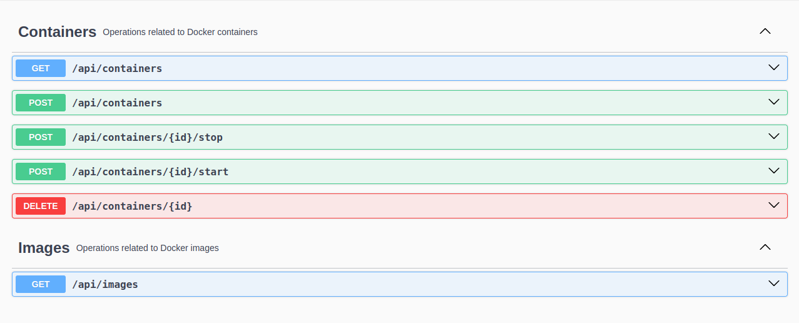

<div align="center">
  <h1>Docker Manager</h1>
</div>

<p align="center">
  
</p>

## Configuração do Docker

Para configurar corretamente o Docker para este projeto, siga os passos abaixo:

1. Modifique o arquivo `/etc/docker/daemon.json`, adicionando a seguinte configuração:

   ```json
   {
     "hosts": ["tcp://0.0.0.0:2375", "unix:///var/run/docker.sock"]
   }
   ```

2. Edite o arquivo `/lib/systemd/system/docker.service` e remova a opção `-H fd://` da propriedade `ExecStart`. Isso garante que a configuração do `daemon.json` não seja sobrescrita.

Após realizar essas mudanças, reinicie o serviço do Docker:

```sh
sudo systemctl daemon-reload
sudo systemctl restart docker
```

## Documentação da API

A documentação da API está disponível nos seguintes endpoints:

- **Swagger UI:** [http://localhost:8080/docs.html](http://localhost:8080/docs.html)
- **Swagger JSON:** [http://localhost:8080/api-docs](http://localhost:8080/api-docs)

## Estrutura do Projeto

O projeto segue a estrutura de diretórios abaixo:

```
src
├── main
│   ├── java
│   │   └── com
│   │       └── docker
│   │           └── manager
│   │               ├── config
│   │               │   └── DockerClientConfig.java
│   │               ├── controllers
│   │               │   ├── DockerContainersController.java
│   │               │   └── DockerImagesController.java
│   │               ├── ManagerApplication.java
│   │               └── services
│   │                   └── DockerService.java
│   └── resources
│       ├── application.yml
│       ├── static
│       └── templates
└── test
    └── java
        └── com
            └── docker
                └── manager
                    └── ManagerApplicationTests.java
```